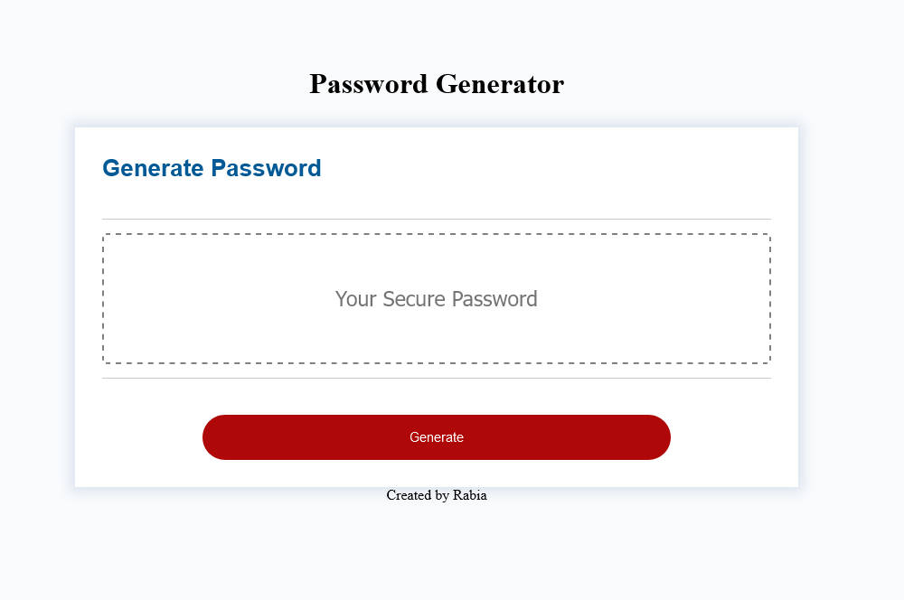

# **Introduction:**

Amazing Password Generator application powered by JavaScript with clean code. You can choose what to include in your password by just clicking OK, cancel from the prompts.

-   UPPERCASE
-   LOWERCASE
-   NUMERIC
-   SPECIAL CHARACTERS

## **Developer Insights:**

I am thankful to my instructors at RutgersCodingBootcamp, that they teach me so well and i have created this portfolio.

## **Resources:**

-   [W3SCHOOLS.COM](https://www.w3schools.com/jsref/met_win_prompt.asp)
-   [Strings Concatenation](https://www.w3schools.com/jsref/jsref_concat_string.asp)
-   [MDN](https://developer.mozilla.org/en-US/docs/Web/JavaScript)

## **Screenshots**

